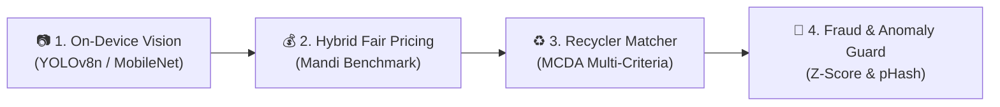

# Kabadiwala Connect (RE:LINK)
**Vernacular, Offline-Tolerant Scrap & E-Waste Traceability Platform**  
*Connecting India's informal scrap collectors with CPCB-authorized recyclers through edge intelligence, fair price discovery, and cryptographic digital handovers.*

[](https://github.com/Srimanikanta2006/kabadiwala-connect/actions/workflows/ci.yml)
[](stitch-designs/design-system.md)
[](shared/taxonomy/material_taxonomy.md)
[](docs/edge_vs_cloud.md)

---

## 1. Problem Context & Mission
Over 90% of India's end-of-life electronics and recyclable scrap is collected by the informal sector (*kabadiwalas*, waste-pickers, aggregators). However, informal collectors remain locked out of the formal Extended Producer Responsibility (EPR) ecosystem established under the **E-Waste (Management) Rules, 2022**.

This disconnection results in:
1. **Severe Price Asymmetry:** Aggregators sell to informal middlemen at steep discounts (20–35% below true market rate).
2. **Hazardous Backyard Processing:** Unsafe practices such as open-air cable burning, manual desoldering, and acid leaching of PCBs cause toxic lead/dioxin exposure while losing critical strategic minerals (Li, Co, Nd, Ta, In).
3. **Zero Digital Traceability:** Without verifiable handover records, informal waste cannot be counted toward national EPR recycling credits.

**Kabadiwala Connect (RE:LINK)** bridges this divide with an **offline-first, vernacular-first (Hindi/Marathi) mobile application** and an **authorized recycler portal**, powered by pragmatic edge AI.

---

## 2. The 4-Stage Intelligence Pipeline

Rather than superficial "AI-washing", intelligence is embedded directly into the transaction lifecycle:



1. **Material Identification (Edge Vision AI):**
   - Quantized **YOLOv8n INT8** running offline on low-end Android devices ($\le 65\text{ ms}$, $\le 6.5\text{ MB}$).
   - Multi-class localization: PCBs (High/Low-grade), CRT glass, LCD panels, copper cables, lead-acid & Li-ion batteries, motors, and engineering plastics.
   - **Human-in-the-Loop UX:** High confidence ($\ge 85\%$) auto-selects with green verification badge; medium ($60\text{--}85\%$) presents top-2 pictorial cards; low ($<60\%$) gracefully falls back to a 6-tile vernacular pictorial grid.
2. **Dynamic Fair Valuation Engine:**
   - Deterministic rule-based pricing for early-stage transparency (Base Mandi Rate $\times$ Condition Multiplier $\times$ Volume Incentive).
   - Generates spoken audio readouts in Hindi and Marathi.
3. **Intelligent Recycler Matching & Ranking:**
   - Multi-Criteria Decision Analysis (MCDA) ranking authorized recyclers on Offered Price ($35\%$), Proximity ($25\%$), CPCB Registration ($20\%$), Payout Speed ($10\%$), and Pickup Service ($10\%$).
4. **Transaction Anomaly & Fraud Detection:**
   - Checks material density bounds, statistical rate outliers ($|Z| > 2.5$), and detects duplicate photo re-uploads using 64-bit perceptual image hashing (`dHash`/`pHash`).

---

## 3. Stitch UI Prototypes & RE:LINK Design System

The full mobile experience has been designed in Stitch under the **RE:LINK** design system, tailored for low-literacy users with high-contrast surfaces, 56px touch targets, and adjacent vernacular audio buttons:

| Screen | Title | Primary Function | Preview |
| :--- | :--- | :--- | :--- |
| **01** | **[Collector Home](stitch-designs/screens/01_collector_home/index.html)** | Daily rate ticker, quick lot creation CTA, audio guide | [Screenshot](stitch-designs/screens/01_collector_home/screenshot.png) |
| **02** | **[AI Material Identification](stitch-designs/screens/02_ai_material_identification/index.html)** | Camera viewfinder, confidence badge, verification chips | [Screenshot](stitch-designs/screens/02_ai_material_identification/screenshot.png) |
| **03** | **[Select Category (Fallback)](stitch-designs/screens/03_create_lot_select_category/index.html)** | High-contrast 6-tile pictorial grid with Hindi/Marathi labels | [Screenshot](stitch-designs/screens/03_create_lot_select_category/screenshot.png) |
| **04** | **[Price Discovery & Offers](stitch-designs/screens/04_price_discovery_offers/index.html)** | Fair mandi price range & ranked CPCB authorized buyers | [Screenshot](stitch-designs/screens/04_price_discovery_offers/screenshot.png) |
| **05** | **[Handover & Traceability](stitch-designs/screens/05_digital_handover_receipt/index.html)** | Offline signed QR token, weighbridge photo, digital receipt | [Screenshot](stitch-designs/screens/05_digital_handover_receipt/screenshot.png) |
| **06** | **[My Earnings History](stitch-designs/screens/06_my_earnings_history/index.html)** | Transparent ledger, pending dues, cash/UPI record | [Screenshot](stitch-designs/screens/06_my_earnings_history/screenshot.png) |

> 🎨 **Interactive Design Gallery:** Open **[`stitch-designs/index.html`](stitch-designs/index.html)** in any browser to inspect all 6 screens and live HTML prototypes side-by-side.

---

## 4. Standard Material Taxonomy (CPCB Aligned)

| ID | English Name | Hindi Name | Marathi Name | CPCB Code | Hazard Level | Rate Range |
| :--- | :--- | :--- | :--- | :--- | :--- | :--- |
| `mat_pcb_high` | High-Grade PCB | हाई-ग्रेड सर्किट बोर्ड | हाय-ग्रेड सर्किट बोर्ड | `ITEW1-PCB-HG` | Low | ₹180 – ₹320/kg |
| `mat_pcb_low` | Low-Grade PCB | लो-ग्रेड सर्किट बोर्ड | लो-ग्रेड सर्किट बोर्ड | `ITEW1-PCB-LG` | Low | ₹35 – ₹75/kg |
| `mat_crt_monitor`| CRT Monitor / TV Tube | सीआरटी मॉनिटर ट्यूब | सीआरटी मॉनिटर ट्यूब | `CEEW1-CRT` | **Hazardous** | ₹8 – ₹18/kg |
| `mat_lcd_panel` | LCD / LED Display | एलसीडी / एलईडी स्क्रीन | एलसीडी / एलईडी स्क्रीन | `CEEW1-FPD` | Medium | ₹25 – ₹60/kg |
| `mat_cables_copper`| Insulated Copper Cables| तांबे के तार / केबल | तांब्याची वायर / केबल | `ITEW-CBL-CU` | Low | ₹240 – ₹420/kg |
| `mat_batteries_lead`| Lead-Acid Battery | लेड-एसिड बैटरी | लेड-अ‍ॅसिड बॅटरी | `BATT-PB-ACID` | **Hazardous** | ₹85 – ₹115/kg |
| `mat_batteries_li_ion`| Lithium-Ion Battery | लिथियम-आयन बैटरी | लिथियम-आयन बॅटरी | `BATT-LI-ION` | **Hazardous** | ₹120 – ₹250/kg |
| `mat_motors_magnets`| Motors & Magnets | मोटर और चुंबक | मोटर आणि मॅग्नेट | `ITEW-MTR-MAG` | Low | ₹45 – ₹95/kg |
| `mat_mixed_plastics`| Technical Plastics | टेक्निकल प्लास्टिक | टेक्निकल प्लास्टिक | `PLAST-ENG-MIX` | Low | ₹18 – ₹38/kg |

*Full specification and safety notes: [`shared/taxonomy/material_taxonomy.md`](shared/taxonomy/material_taxonomy.md).*

---

## 5. Repository Structure

```
Kabadiwala-Connect/
├── .github/
│   ├── branch-protection-rules.md   # Main branch governance & PR rules
│   └── workflows/ci.yml             # Automated contract & schema validation
├── backend/                         # FastAPI REST Backend
│   ├── app/
│   │   ├── models/database.py       # SQLAlchemy ORM schemas for 7 datasets
│   │   ├── schemas/pydantic_models.py # Pydantic v2 request/response models
│   │   └── services/
│   │       ├── pricing_engine.py    # Mandi price engine & vernacular audio text
│   │       ├── recycler_matcher.py  # Multi-Criteria Decision Analysis ranking
│   │       └── anomaly_detector.py  # Weight bounds & pHash duplicate filter
│   ├── tests/test_api.py            # Automated API and business logic tests
│   ├── requirements.txt
│   └── main.py                      # FastAPI application entry point
├── shared/
│   ├── taxonomy/                    # Standardized taxonomy (JSON & Markdown)
│   ├── schemas/                     # Draft-07 JSON schemas for all 7 datasets
│   └── contracts/api_contracts.md   # Complete REST API specification
├── docs/
│   ├── edge_vs_cloud.md             # Offline-first & edge vs cloud boundaries
│   ├── confidence_and_fallbacks.md  # 3-Tier AI confidence UX policy
│   ├── datasets_and_licensing.md    # Public datasets, licenses & DPDP compliance
│   └── ml_training_validation_methodology.md # Train/val/test splits & augmentations
├── ml/
│   └── scripts/
│       ├── data_augmentation.py     # Real-world dirty/shadow/blur augmentations
│       └── quantize_tflite.py       # INT8 Post-training quantization utility
├── stitch-designs/                  # Stitch UI assets & interactive gallery
│   ├── screens/                     # Downloaded HTML and PNG screenshots
│   ├── assets/                      # Real scrap reference images
│   ├── design-system.md             # RE:LINK Design System Tokens
│   └── index.html                   # Visual Screen Gallery
├── .gitignore
└── README.md
```

---

## 6. Quickstart & Setup

### Prerequisites
- Python 3.11+
- Git

### 1. Run the Backend API
```bash
cd backend
python -m venv .venv
# On Windows:
.venv\Scripts\activate
# On Linux/macOS:
source .venv/bin/activate

pip install -r requirements.txt
python main.py
```
API will start on `http://localhost:8000`. Interactive OpenAPI documentation available at `http://localhost:8000/docs`.

### 2. Run Test Suite
```bash
cd backend
pytest tests/test_api.py -v
```

### 3. Explore Stitch UI Gallery
Double-click or open `stitch-designs/index.html` in Chrome or Edge to browse all 6 screens with live HTML prototypes.

---

## 7. Licensing & Governance
- **Code:** Licensed under [MIT License](LICENSE).
- **Taxonomy & Schemas:** Licensed under [CC BY 4.0](https://creativecommons.org/licenses/by/4.0/).
- **Data Compliance:** Designed to adhere strictly to India's **CPCB E-Waste (Management) Rules 2022** and **Digital Personal Data Protection (DPDP) Act 2023**.
