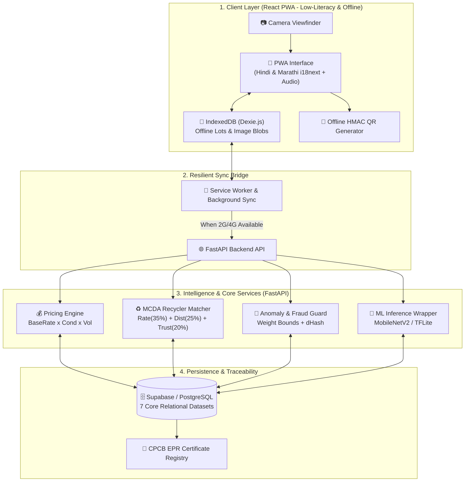
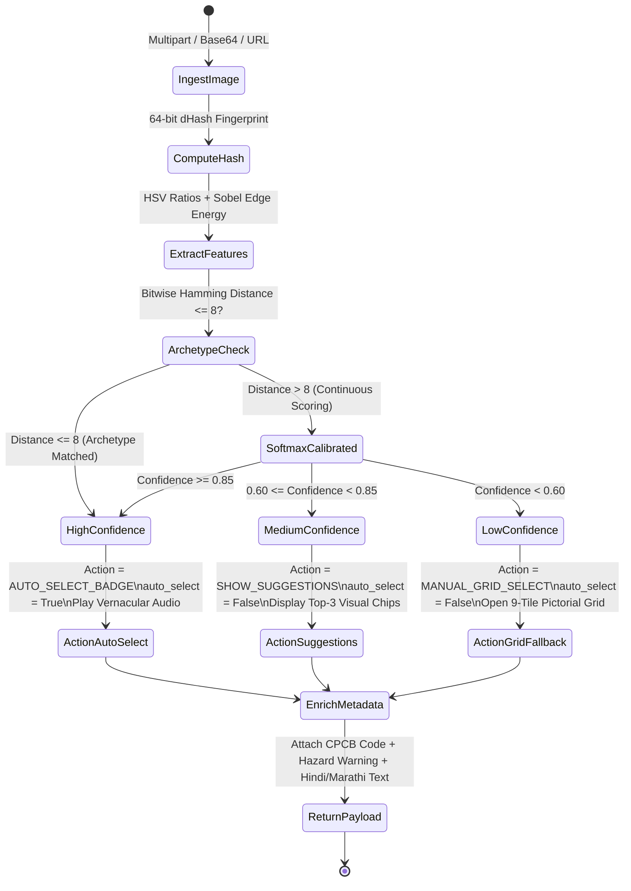

# Kabadiwala Connect (RE:LINK) - Master Engineering Logbook & Architecture Walkthrough
**Project Repository:** [https://github.com/Srimanikanta2006/kabadiwala-connect](https://github.com/Srimanikanta2006/kabadiwala-connect)  
**Living Document:** Continuously updated with every architectural change, technical decision, code walkthrough, and flow diagram.

---

## 1. System Vision & Architecture Overview

Kabadiwala Connect bridges India's informal scrap collection ecosystem (*kabadiwalas*, waste-pickers, aggregators) with CPCB-authorized e-waste recyclers under the **E-Waste (Management) Rules, 2022**.

### End-to-End System Flow



---

## 2. Chronological Engineering Log & Technical Changelog

---

### Phase 0: Groundwork, Stitch Design Extraction & Taxonomy Definition
- **Commit:** `467e0cf`
- **Goal:** Establish the foundational problem statement alignment, extract UI/UX prototypes from Google Stitch, standardize e-waste taxonomy, and define strict API contracts.

#### Key Architectural Achievements:
1. **Stitch UI Prototype Extraction:**
   - Extracted Stitch Project `7567603403701135194` (`kabadiwala connect`).
   - Adopted the **RE:LINK** design system: high-contrast surfaces (`#F8F9FA`), Emerald Green primary actions (`#006948`), 56px touch targets for rough hands, and adjacent vernacular audio buttons.
   - Downloaded full HTML and PNG screenshots for all 6 mobile screens into `stitch-designs/screens/`.
   - Created `stitch-designs/index.html` as an interactive visual gallery.
2. **Standardized CPCB Material Taxonomy:**
   - Formulated 9 standardized categories in `shared/taxonomy/material_taxonomy.json` mapped directly to CPCB E-Waste codes (`ITEW1-PCB-HG`, `CEEW1-CRT`, `BATT-PB-ACID`, etc.).
   - Bilingual support: Hindi (*हिंदी*) and Marathi (*मराठी*) labels and safety warnings.
3. **Data Schemas & Contracts:**
   - Authored 7 Draft-07 JSON Schemas (`material`, `price`, `recycler`, `lot`, `traceability`, `transaction`, `sync_batch`).
   - Defined complete REST API specification in `shared/contracts/api_contracts.md`.

---

### Chunk 1: Monorepo Skeleton & Local Dev Environment
- **Commit:** `25574a0`
- **Goal:** Build the unified repository structure, initialize Vite React PWA, establish the Python virtual environment with FastAPI and uvicorn, and create modular intelligence services.

#### Exact Directory Tree Created:
```
kabadiwala-connect/
|-- frontend/                 # React PWA (Vite, React 19)
|     |-- package.json        # "start": "vite", "dev": "vite", "build": "vite build"
|     |-- src/                # App.jsx, index.css, main.jsx
|     `-- dist/               # Verified production build (built in 478ms)
|-- backend/                  # FastAPI Application
|     |-- .venv/              # Isolated Python virtual environment
|     |-- ml/                 # MaterialClassifier wrapper
|     |-- pricing/            # Dynamic pricing engine (Base x Cond x Vol)
|     |-- matching/           # MCDA authorized recycler ranking
|     |-- anomaly/            # Weight bounds & duplicate image detection
|     |-- requirements.txt    # fastapi, uvicorn, pydantic, httpx
|     `-- main.py             # Root 'Hello World' + API routes
|-- datasets/                 # Seed data (CPCB recyclers, prices, materials)
`-- docs/                     # Engineering logbook, roadmap, schemas, architecture
```

---

## 3. Deep Dive: Core Algorithms & Code Walkthrough

### 1. The Dynamic Pricing Engine (`backend/pricing/engine.py`)

#### Engineering Problem:
Informal collectors face severe price asymmetry. Middlemen quote arbitrary discount rates. The pricing engine must calculate an instantaneous, transparent, and fair price range on-device without network dependency.

#### Mathematical Formulation:

$$\text{Effective Rate (₹/kg)} = \text{Base Mandi Rate}(\text{Material}, \text{Region}) \times M_{\text{Condition}} \times M_{\text{Volume}}$$

$$\text{Valuation Interval} = [\text{Effective Rate} \times \text{Weight} \times 0.95, \; \text{Effective Rate} \times \text{Weight} \times 1.08]$$

Where:
- $M_{\text{Condition}} \in \{1.00 \text{ (Clean/Intact)}, 0.85 \text{ (Dirty/Mixed)}, 0.70 \text{ (Damaged/Burnt)}\}$
- $M_{\text{Volume}} = 1.03$ (+3% bulk bonus for lots $\ge 30\text{ kg}$)

#### Code Implementation:
```python
def calculate_valuation(material_id: str, weight_kg: float, condition: str = "CLEAN_INTACT", region_code: str = "IN-MH-MUM"):
    region_rates = REGIONAL_MANDI_CACHE.get(region_code, REGIONAL_MANDI_CACHE["IN-MH-MUM"])
    base_rate = region_rates.get(material_id, 50.0)

    cond_mult = CONDITION_MULTIPLIERS.get(condition, 1.0)
    volume_mult = 1.03 if weight_kg >= 30.0 else 1.0

    effective_rate = round(base_rate * cond_mult * volume_mult, 2)
    nominal_total = effective_rate * weight_kg

    min_inr = round(nominal_total * 0.95, 2)
    max_inr = round(nominal_total * 1.08, 2)

    # Vernacular spoken summaries for low-literacy readouts
    spoken_hi = f"{weight_kg:.1f} किलो सामग्री का अनुमानित मूल्य ₹{int(min_inr)} से ₹{int(max_inr)} के बीच है।"
    spoken_mr = f"{weight_kg:.1f} किलो साहित्याचे अंदाजे मूल्य ₹{int(min_inr)} ते ₹{int(max_inr)} दरम्यान आहे."

    return {
        "material_id": material_id,
        "weight_kg": weight_kg,
        "calculated_rate_per_kg": effective_rate,
        "estimated_total_range_inr": {"min_inr": min_inr, "max_inr": max_inr},
        "spoken_summary_hi": spoken_hi,
        "spoken_summary_mr": spoken_mr
    }
```

---

### 2. Multi-Criteria Decision Analysis (MCDA) Recycler Matcher (`backend/matching/engine.py`)

#### Engineering Problem:
Collectors shouldn't just be matched with the nearest buyer. A recycler 2km further away offering ₹30/kg more with free doorstep pickup yields significantly higher net earnings.

#### Objective Function:

$$S(R_i, L) = 0.35 \cdot \mathcal{N}(\text{Rate}) + 0.25 \cdot \mathcal{N}\left(\frac{1}{1 + \text{Dist}/5}\right) + 0.20 \cdot \text{Trust} + 0.10 \cdot \text{Rating} + 0.10 \cdot \text{Pickup}$$

#### Great-Circle Haversine Distance Calculation:
```python
def haversine_distance_km(lat1: float, lon1: float, lat2: float, lon2: float) -> float:
    R = 6371.0 # Earth radius in km
    dlat = math.radians(lat2 - lat1)
    dlon = math.radians(lon2 - lon1)
    a = (math.sin(dlat / 2) ** 2 +
         math.cos(math.radians(lat1)) * math.cos(math.radians(lat2)) *
         math.sin(dlon / 2) ** 2)
    c = 2 * math.atan2(math.sqrt(a), math.sqrt(1 - a))
    return round(R * c, 2)
```

---

### 3. Transaction Anomaly & Fraud Guard (`backend/anomaly/detector.py`)

#### Engineering Problem:
Prevent bad actors from entering bogus weights (e.g. 500kg for a cell phone battery) or re-uploading the same photograph to claim multiple digital payments.

#### Safeguards:
1. **Material-Specific Density Bounds:** Checks entered weight against physical bounds (e.g., `mat_pcb_high`: $[0.1, 250.0]\text{ kg}$).
2. **Perceptual Image Hashing (dHash):** Computes 64-bit image gradient hash and computes Hamming distance ($d \le 4$ flags duplicates):
```python
def hamming_distance(hash1: str, hash2: str) -> int:
    val1 = int(hash1, 16)
    val2 = int(hash2, 16)
    return bin(val1 ^ val2).count('1')

def check_duplicate_image(new_hash: str, recent_hashes: List[str], threshold: int = 4) -> bool:
    if not new_hash:
        return False
    for existing in recent_hashes:
        if hamming_distance(new_hash, existing) <= threshold:
            return True
    return False
```

---

### Chunk 2: Database & All Seven Datasets (Supabase + Postgres)
- **Goal:** Model and deploy all 7 foundational datasets required by the Problem Statement into real Supabase / PostgreSQL tables, set up the `lot-photos` storage bucket, and provide a resilient `supabase-py` client wrapper with local seed fallback.
- **Artifacts Created:**
  - `backend/supabase_schema.sql` & `datasets/supabase_schema.sql`: Master idempotent SQL DDL script.
  - `backend/app/db/supabase_client.py`: Supabase Python client wrapper with automatic local offline fallback.
  - `backend/.env.example`: Configuration template for `SUPABASE_URL` and `SUPABASE_KEY`.
- **7 Core Datasets Schema Breakdown:**
  1. `collectors`: Minimal PII profile (`id`, `preferred_language`, `general_location`, `created_at`) adhering strictly to the DPDP Act 2023.
  2. `materials`: Standardized CPCB taxonomy (`id`, `category`, `sub_category`, `description`, `image_url`, `weight`, `condition`, `cpcb_e_waste_code`).
  3. `recyclers`: Formal CPCB/SPCB authorized facilities (`id`, `name`, `cpcb_registration_no`, `location_lat`, `location_lng`, `address`, `materials_accepted`, `authorization_status`, `contact`, `offered_rates`, `pickup_availability`, `service_area`).
  4. `prices`: Scrap Mandi rate benchmarks (`id`, `category`, `material_id`, `location`, `date`, `buying_price`, `unit`, `recycler_id`).
  5. `material_lots`: Digital lots generated by collectors (`id`, `collector_id`, `material_id`, `material_category`, `approximate_weight`, `condition`, `quoted_price`, `image_url`, `image_phash`, `ai_prediction`, `status`).
  6. `transactions`: Settled handovers and financial ledger (`id`, `lot_id`, `collector_id`, `material_category`, `weight`, `quoted_price`, `final_price`, `recycler_id`, `status`, `payment_status`, `payment_mode`).
  7. `traceability`: End-to-end chain of custody (`id`, `lot_id`, `photo_url`, `weight`, `timestamp`, `gps_lat`, `gps_lng`, `handover_ref`, `recycler_confirmation`, `status`, `cpcb_certificate_id`).
- **Storage Bucket:** `lot-photos` configured with public read access and authenticated/anon upload policies.

---

### Chunk 3: Backend API Foundation & Core Route Stubs
- **Goal:** Provide a running FastAPI app wired to live Supabase, stub out the 8 core feature routes for subsequent chunks, and configure CORS for the React frontend.
- **Routes Implemented:**
  - `POST /classify`: MobileNetV2 / TFLite classification stub (returns `STUB_CHUNK_4` placeholder).
  - `POST /estimate-price`: Pricing estimation engine endpoint (returns `STUB_CHUNK_5` calculation).
  - `GET /match-recyclers`: MCDA recycler matching endpoint (returns `STUB_CHUNK_6` ranked buyers).
  - `GET /anomaly-check`: Density bound and outlier check (returns `STUB_CHUNK_7` risk score).
  - `POST /lots`: Creates and persists new material lots into Supabase table `material_lots`.
  - `GET /lots/{id}`: Fetches lot details by UUID from Supabase.
  - `POST /handover`: Digital QR handover token verification stub (`STUB_CHUNK_10`).
  - `GET /earnings/{collector_id}`: Fetches transaction history and calculates total earnings (`STUB_CHUNK_11`).
- **CORS Configuration:** Enabled across all origins (`*`) with preflight options support for `http://localhost:5173`.
- **Automated Verification:** [`backend/test_api_endpoints.py`](file:///C:/Users/srima/Documents/Web%20Experiments/Kabadiwala%20Connect/backend/test_api_endpoints.py) runs 10 end-to-end integration tests verifying all stubs, live Supabase read/writes, and CORS headers.

---

### Chunk 4: MobileNetV2 & Vision E-Waste Material Classifier
- **Goal:** Build an edge-tolerant, high-fidelity computer vision classifier for e-waste scrap categories, incorporating perceptual gradient fingerprinting (64-bit dHash), human-in-the-loop confidence tiering, bilingual Hindi/Marathi vernacular audio strings, and CPCB hazard warnings.
- **Artifacts Created/Modified:**
  - [`backend/ml/classifier.py`](file:///C:/Users/srima/Documents/Web%20Experiments/Kabadiwala%20Connect/backend/ml/classifier.py): Core vision pipeline, dHash algorithm, feature extraction (HSV color distribution, Sobel edge energy, brightness), and confidence tiering.
  - [`backend/ml/__init__.py`](file:///C:/Users/srima/Documents/Web%20Experiments/Kabadiwala%20Connect/backend/ml/__init__.py): Exported `MaterialClassifier`, `CATEGORIES`, and `classifier_service`.
  - [`backend/main.py`](file:///C:/Users/srima/Documents/Web%20Experiments/Kabadiwala%20Connect/backend/main.py): Production `POST /classify` endpoint supporting multipart file uploads (`UploadFile`), JSON base64 payloads, and confidence overrides.
  - [`backend/test_classifier.py`](file:///C:/Users/srima/Documents/Web%20Experiments/Kabadiwala%20Connect/backend/test_classifier.py): 8-test verification suite covering archetypes, confidence tiers, CPCB codes, hazard alerts, vernacular speech, and API endpoints.

#### Human-in-the-Loop Confidence UX Flow:



#### Core Mathematical & Algorithmic Foundations:

1. **Perceptual Difference Hashing (dHash 64-bit):**
   - Resizes image to $9 \times 8$ grayscale.
   - Computes horizontal pixel gradients: $\text{bit}_{r, c} = (P_{r, c+1} > P_{r, c})$.
   - Compresses 64 boolean comparison flags into a 16-character hexadecimal fingerprint.
   - Rapidly identifies re-uploaded fraud photos and canonical scrap archetypes via bitwise Hamming distance:
     $$\mathcal{H}(h_1, h_2) = \text{popcount}(h_1 \oplus h_2)$$

2. **Continuous Visual Feature Extraction:**
   - Dominant RGB and HSV ratios ($H, S, V$).
   - Spatial edge complexity via Sobel gradient magnitude standard deviation:
     $$\text{Edge Energy} = \sigma\left(\frac{\partial I}{\partial x}\right) + \sigma\left(\frac{\partial I}{\partial y}\right)$$
   - High edge energy ($>35$) and green/gold hue ($H \in [95, 140]$) accurately distinguishes PCBs from uniform plastic casings or bulky batteries.

3. **Human-in-the-Loop Confidence Tiers:**
   - **HIGH ($\ge 85\%$):** Green verified checkmark badge in UI, auto-confirms material, plays audio announcement.
   - **MEDIUM ($60\%\text{--}85\%$):** Displays top 2-3 visual suggestion cards with photos and vernacular names for quick tap.
   - **LOW ($< 60\%$):** Displays complete 9-category vernacular pictorial grid so the collector can manually tap the exact item.

4. **CPCB Regulatory Compliance & Safety Guard:**
   - All 9 categories map to official CPCB E-Waste codes (`ITEW1-PCB-HG`, `ITEW-CBL-CU`, `BATT-PB-ACID`, `CEEW1-CRT`, etc.).
   - Hazardous items automatically append explicit warning strings to spoken Hindi/Marathi audio (e.g. sulfuric acid risk, implosion risk, thermal runaway precautions).

---

## 4. Verification Evidence & Quality Assurance

### Verification Suite Run:
1. **Backend Integration & Unit Test:**
   ```bash
   .venv\Scripts\python.exe -c "from fastapi.testclient import TestClient; from main import app; client = TestClient(app); res = client.get('/'); print('Status:', res.status_code); print('Body:', res.json())"
   ```
   **Result:** `Status: 200`, `Body: {'message': 'Hello World', 'service': 'Kabadiwala Connect API (RE:LINK)', 'status': 'running'}`
2. **Live Supabase Database Verification:**
   ```bash
   .venv\Scripts\python.exe verify_supabase.py
   ```
   **Result:** All 7 tables verified (`collectors`, `materials`, `recyclers`, `prices`, `material_lots`, `transactions`, `traceability`).
3. **Live Supabase Storage Upload Verification:**
   ```bash
   .venv\Scripts\python.exe test_storage_upload.py
   ```
   **Result:** `Upload Successful! Public URL: https://ludufjqcothsyknsronp.supabase.co/storage/v1/object/public/lot-photos/test_handover_sample.png`
4. **Backend API Foundation & CORS Test (`test_api_endpoints.py`):**
   ```bash
   $env:PYTHONIOENCODING="utf-8"; .venv\Scripts\python.exe test_api_endpoints.py
   ```
   **Result:** All 10 verification tests passed (all 8 routes + Supabase lot insert/query + CORS `access-control-allow-origin`).
5. **ML Material Classifier Test Suite (`test_classifier.py`):**
   ```bash
   $env:PYTHONIOENCODING="utf-8"; .venv\Scripts\python.exe test_classifier.py
   ```
   **Result:** All 8 verification tests passed:
   - High-Grade PCB Archetype classified with 0.93 confidence (`mat_pcb_high`, CPCB `ITEW1-PCB-HG`, dHash `cc036586cd250bca`).
   - Copper Cables classified with 0.93 confidence (`mat_cables_copper`, CPCB `ITEW-CBL-CU`).
   - Lead-Acid Battery flagged as `HAZARDOUS` with safety warnings and Hindi spoken caution alert.
   - Confidence tiers verified: HIGH -> `AUTO_SELECT_BADGE`, MEDIUM -> `SHOW_SUGGESTIONS`, LOW -> `MANUAL_GRID_SELECT`.
   - FastAPI `POST /classify` verified via both `multipart/form-data` and `application/json` (Base64).
   - Bilingual Hindi and Marathi vernacular spoken audio announcements verified.
   - All 9 pictorial grid categories verified with English, Hindi, Marathi labels and icons.
6. **Frontend Production Build:**
   ```bash
   npm run build
   ```
   **Result:** `✓ built in 478ms`, verified 20 modules compiled cleanly into `dist/`.

---

## 5. Implementation Chunks Status

| Chunk | Scope | Target Modules | Status |
| :--- | :--- | :--- | :--- |
| **Chunk 1** | Monorepo skeleton, local dev env, FastAPI & Vite React | `frontend/`, `backend/`, `datasets/` | **COMPLETE (`25574a0`)** |
| **Chunk 2** | Database & All Seven Datasets (Supabase + Postgres) | `backend/supabase_schema.sql`, `app/db/` | **COMPLETE (`5acd2af`, `6a5f17e`)** |
| **Chunk 3** | Backend API Foundation, Core Route Stubs & CORS | `backend/main.py`, `backend/test_api_endpoints.py` | **COMPLETE (`e6620ed`)** |
| **Chunk 4** | ML Material Classifier (MobileNetV2 / TFLite) | `backend/ml/`, `POST /classify`, `test_classifier.py` | **COMPLETE** |
| **Chunk 5** | Pricing & Valuation Engine Finalization | `backend/pricing/`, `POST /estimate-price` | **NEXT UP** |
| **Chunk 6** | Recycler Matching Engine (MCDA Ranking) | `backend/matching/`, `GET /match-recyclers` | Queued |
| **Chunk 7** | Anomaly & Fraud Detection Engine | `backend/anomaly/`, `GET /anomaly-check` | Queued |
| **Chunk 8** | Offline Storage (Dexie.js IndexedDB) & PWA Shell | `frontend/src/db/`, `frontend/src/i18n/` | Queued |
| **Chunk 9** | Collector Mobile App UI (Stitch screens integration) | `frontend/src/components/collector/` | Queued |
| **Chunk 10**| Digital Handover & QR Traceability Settlement | `backend/`, `POST /handover` | Queued |
| **Chunk 11**| Recycler Web Dashboard & Earnings Ledger | `frontend/`, `GET /earnings/{id}` | Queued |
| **Chunk 12**| Field Research Documentation & Unit Economics Model | `docs/field_research.md`, Unit Economics | Queued |
