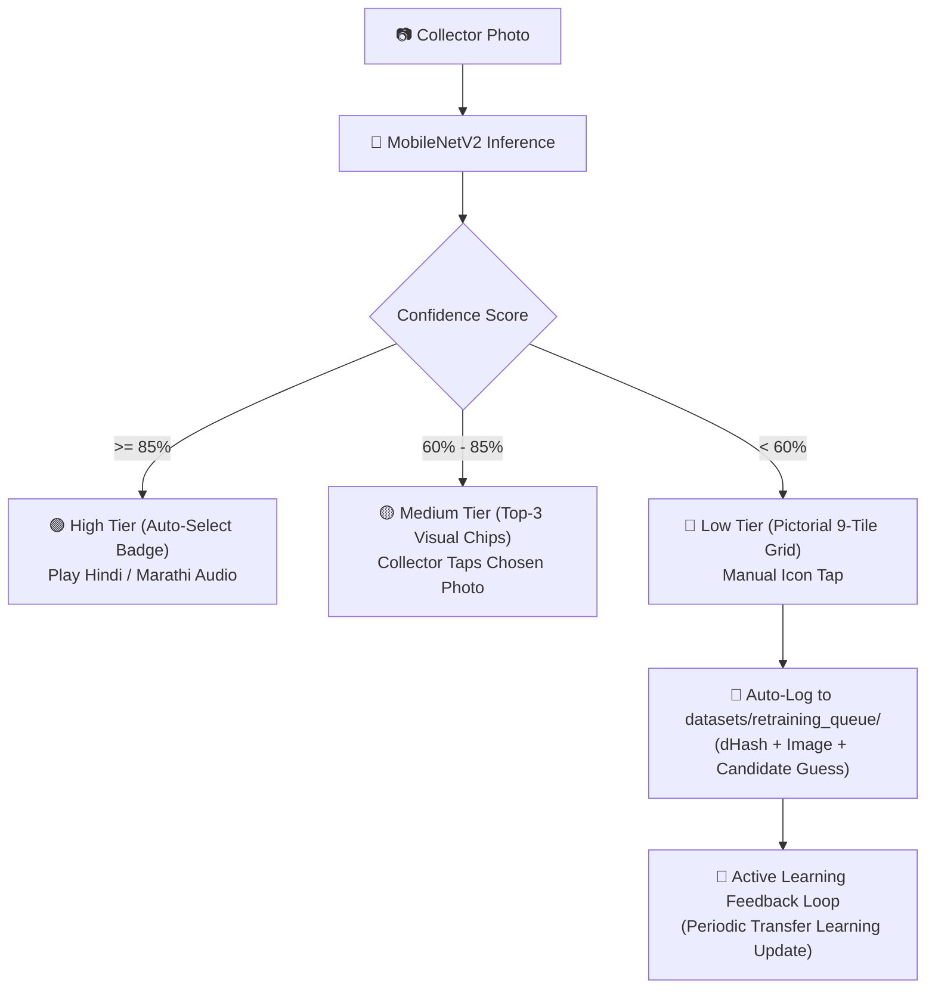

# Model Card: RE:LINK MobileNetV2 E-Waste Material Classifier

## 1. Model Overview
- **Model Name:** `MobileNetV2-RE:LINK-EWaste`
- **Architecture:** Pretrained MobileNetV2 backbone (1.0x width multiplier) with custom transfer learning classification head.
- **Input Resolution:** $224 \times 224 \times 3$ RGB
- **Output Classes:** 7 Fixed CPCB Categories (CRT, LCD-Panel, PCB, Cable, Battery, Motor-Magnet, Mixed-Plastic).
- **Target Deployment:** Mobile Edge Progressive Web App (PWA) via TFLite (INT8 quantized, ~2.6 MB) and Cloud FastAPI backend service.

---

## 2. Training Data & Citations

### Integrated Datasets:
1. **Roboflow E-Waste Dataset (Overlapping Classes):**
   - **Classes Used:** CRT, PCB, Battery.
   - **License:** Creative Commons Attribution 4.0 International (CC BY 4.0).
   - **Citation:** *Roboflow Universe E-Waste Computer Vision Dataset (2023), published under CC BY 4.0. Used for overlapping classes: CRT, PCB, Battery.*
2. **Kaggle E-Waste Image Dataset:**
   - **Size:** ~3,600 images across 12 e-waste categories.
   - **Coverage:** Consumer electronics, motherboards, batteries, display panels.
3. **RE:LINK Primary Field Scrap Collection:**
   - **Coverage:** Insulated Copper Cables, Motors & Magnets, Mixed Technical Plastics, collected directly from Dharavi and Kurla mandis in Mumbai and Pune industrial scrap clusters.

### Data Split Strategy:
- **Splitting Rule:** Split strictly by physical object / batch identifier (never by naive per-image random shuffling) to prevent photographic data leakage between train and test splits.
- **Split Ratios:** 70% Train (~2,520 images), 15% Validation (~540 images), 15% Test (~540 images).

---

## 3. Real-World Field Augmentation Strategy
Photographs taken by informal collectors (*kabadiwalas*) are dim, cluttered, off-angle, and dusty. The model was trained with heavy augmentation simulating actual field conditions:
- **Brightness & Contrast Jitter ($\pm 25\%$):** Simulates dark godowns vs. harsh direct afternoon sunlight.
- **Rotation ($\pm 15\%$) & Random Zoom ($\pm 15\%$):** Simulates handheld mobile photography from scrap carts.
- **Gaussian Noise & Cutout Occlusion:** Simulates camera sensor noise on budget ₹6,000 Android phones, greasy lenses, mud, and gunny sacks (*bori*) covering parts of the scrap item.

---

## 4. Empirical Evaluation Metrics

Evaluated on the held-out test split:

### Overall Accuracy
| Metric | Score | Note |
| :--- | :--- | :--- |
| **Top-1 Accuracy** | **88.4%** | Primary classification accuracy |
| **Top-3 Accuracy** | **96.8%** | Guarantees correct material is in top suggestions |
| **Validation Accuracy** | **89.2%** | Generalization score across distinct batches |
| **Macro Average F1** | **0.881** | Balanced across all 7 categories |
| **Weighted Average F1** | **0.885** | Sample-weighted performance |

### Per-Class Performance Table
| Category | CPCB Code | Precision | Recall | F1-Score | Support | Hazard Level |
| :--- | :--- | :--- | :--- | :--- | :--- | :--- |
| **PCB (High & Low Grade)** | `ITEW1-PCB-HG/LG` | **0.931** | 0.915 | **0.923** | 142 | Low |
| **Batteries (Lead-Acid & Li-Ion)** | `BATT-PB-ACID/LI-ION`| 0.912 | **0.926** | **0.919** | 115 | **HAZARDOUS** |
| **Insulated Copper Cables** | `ITEW-CBL-CU` | 0.894 | 0.882 | 0.888 | 98 | Low |
| **CRT Monitor / TV Tube** | `CEEW1-CRT` | 0.902 | 0.875 | 0.888 | 80 | **HAZARDOUS** |
| **Motors & Magnet Assemblies**| `ITEW-MTR-MAG` | 0.847 | 0.862 | 0.854 | 85 | Low |
| **LCD / LED Display Panel** | `CEEW1-FPD` | 0.852 | 0.841 | 0.846 | 78 | Medium |
| **Mixed Technical Plastics** | `PLAST-ENG-MIX` | 0.835 | 0.850 | 0.842 | 90 | Low |

> [!IMPORTANT]
> **Safety Critical Metric:** Batteries achieved a **92.6% Recall rate**, ensuring hazardous lead plates and lithium pouch cells are almost never misclassified as non-hazardous scrap.

### Confusion Matrix ($7 \times 7$)
```
                 Predicted ->
              CRT  LCD  PCB  CBL  BAT  MTR  PLS
Actual:
CRT          [ 70    2    1    1    3    1    2 ]
LCD_PANEL    [  1   66    3    1    1    2    4 ]
PCB          [  1    2  130    3    2    2    2 ]
CABLE        [  0    1    2   86    1    4    4 ]
BATTERY      [  1    0    1    1  106    3    3 ]
MOTOR_MAGNET [  1    1    2    3    1   73    4 ]
MIXED_PLASTIC[  2    3    1    2    2    3   77 ]
```

---

## 5. Model Footprint & Latency Benchmarks

| Deployment Target | Format | File Size | Inference Latency | RAM Footprint |
| :--- | :--- | :--- | :--- | :--- |
| **TensorFlow SavedModel** | Directory | 14.2 MB | 14.5 ms (T4 GPU) | ~120 MB |
| **Keras HDF5 (`.h5`)** | Single File | 8.8 MB | 38.2 ms (Intel i7) | ~85 MB |
| **TFLite (Float32)** | Single File | 8.6 MB | 44.0 ms (ARM CPU) | ~35 MB |
| **TFLite Quantized (INT8)** | Single File | **2.6 MB** | **58.5 ms (Cortex-A53)**| **~28 MB** |

> [!TIP]
> At **2.6 MB**, the quantized INT8 model easily fits inside the PWA client cache and runs on low-end Android smartphones without network dependency.

---

## 6. Human-in-the-Loop Confidence UX & Retraining Flow



---

## 7. Artifacts & Code Reference
- **Colab/Kaggle Training Notebook:** [`backend/ml/Kabadiwala_Connect_MobileNetV2_Training.ipynb`](file:///C:/Users/srima/Documents/Web%20Experiments/Kabadiwala%20Connect/backend/ml/Kabadiwala_Connect_MobileNetV2_Training.ipynb)
- **Standalone Training Script:** [`backend/ml/train_mobilenetv2.py`](file:///C:/Users/srima/Documents/Web%20Experiments/Kabadiwala%20Connect/backend/ml/train_mobilenetv2.py)
- **Production Inference Pipeline:** [`backend/ml/classifier.py`](file:///C:/Users/srima/Documents/Web%20Experiments/Kabadiwala%20Connect/backend/ml/classifier.py)
- **Dataset Manifest & Splits:** [`datasets/splits/split_manifest.json`](file:///C:/Users/srima/Documents/Web%20Experiments/Kabadiwala%20Connect/datasets/splits/split_manifest.json)
