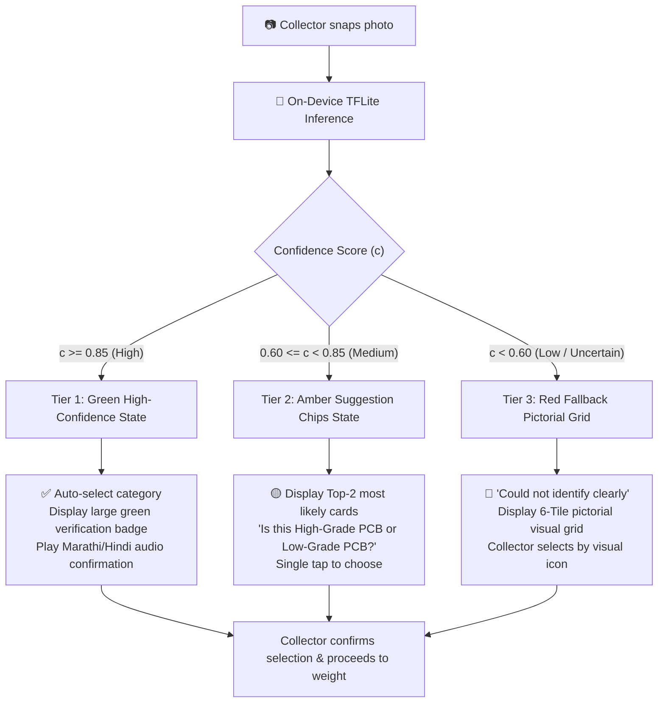

# AI Confidence Thresholds & UX Fallback Behavior
**Feature:** On-Device Computer Vision Material Identification  
**Engine:** Quantized YOLOv8n / MobileNetV4 (TFLite INT8 on Android)

---

## 1. The 3-Tier Confidence Policy

Because an incorrect material classification can mislead an informal collector on valuation or lead to hazardous handling (e.g., confusing a lead-acid battery with general plastics), the platform enforces strict human-in-the-loop confidence gating:

---

## 2. Detailed UX States & Product Behavior

### Tier 1: High Confidence ($c \ge 85\%$)
- **Visual State:**
  - Bounding box rendered around detected material with a bold emerald green pill: `High-Grade PCB (92%)` / `हाई-ग्रेड सर्किट बोर्ड (92%)`.
  - Checkmark icon pre-selected.
- **Audio Behavior:**
  - Speaks: *"हाई-ग्रेड सर्किट बोर्ड पहचाना गया। वजन दर्ज करें।"* (High-grade circuit board detected. Please enter weight.)
- **Collector Override:**
  - A prominent "बदलिए / बदला" (Change) button remains available so the collector can override if incorrect.

### Tier 2: Medium Confidence ($60\% \le c < 85\%$)
- **Visual State:**
  - Amber banner: *"कृपया पुष्टि करें / कृपया खात्री करा"* (Please confirm).
  - Displays side-by-side pictorial cards of the top 2 predictions (e.g., [High-Grade PCB 72%] vs [Low-Grade PCB 24%]).
- **Audio Behavior:**
  - Speaks: *"क्या यह हाई-ग्रेड पीसीबी है या लो-ग्रेड? सही कार्ड दबाएं।"* (Is this high-grade PCB or low-grade? Tap the correct card.)
- **Action:** Collector taps one card to select.

### Tier 3: Low Confidence / Out-of-Distribution ($c < 60\%$)
- **Trigger Conditions:**
  - Poor lighting (dark room or heavy lens glare).
  - Heavy motion blur.
  - Multi-material clutter with no dominant object.
  - Unrecognized non-e-waste object (e.g., domestic food waste, wood, shoes).
- **Visual State:**
  - Warning banner: *"सामग्री पहचान में नहीं आई / साहित्य ओळखू शकले नाही"* (Material could not be recognized).
  - Immediately opens the high-contrast 6-tile pictorial category grid.
  - No speculative AI guesses are displayed.
- **Audio Behavior:**
  - Speaks: *"सामग्री पहचान में नहीं आई। नीचे दिए गए चित्रों में से चुनें।"* (Material was not recognized. Please choose from the pictures below.)

---

## 3. Active Learning & Correction Logging
Whenever a collector overrides an AI suggestion:
1. The original image, the AI prediction, and the collector-chosen category are marked with a flag: `was_corrected_by_user = true`.
2. The image hash and labels are saved into the local SQLite sync queue.
3. Upon reconnection, this sample is sent to the backend `ai_training_samples` bucket as a hard-negative sample for future model fine-tuning.
