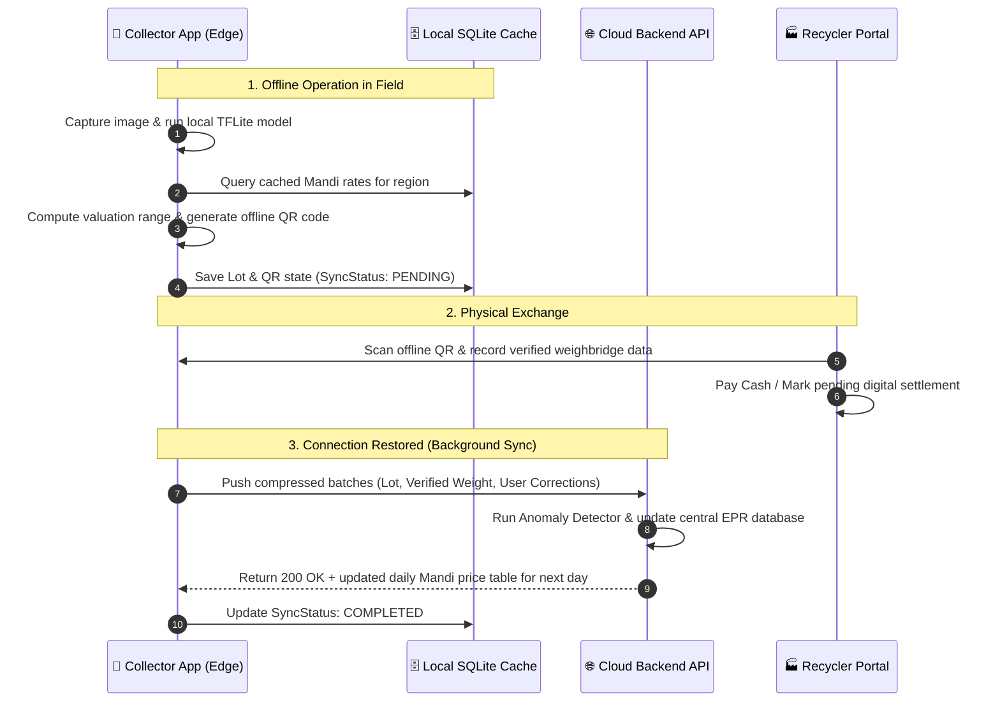

# Edge vs. Cloud Processing Architecture
**System:** Kabadiwala Connect (RE:LINK)  
**Constraints:** Entry-level Android devices ($<2\text{GB}$ RAM), 2G/EDGE or offline connectivity, low battery consumption.

---

## 1. Architectural Distribution Matrix

| System Capability | Execution Environment | Model / Tooling | Offline Capability | Latency Target | Rationale |
| :--- | :--- | :--- | :--- | :--- | :--- |
| **Material Vision Classification** | **On-Device (Edge)** | TFLite INT8 Quantized YOLOv8n / MobileNetV4 | **100% Offline** | $<80\text{ ms}$ | Collector is in field without dependable 4G/5G; instant feedback is required during photo snap. |
| **Vernacular Audio Guidance** | **On-Device (Edge)** | Pre-bundled audio assets (`.mp3`/`.opus`) + Android native TTS | **100% Offline** | $<20\text{ ms}$ | High-quality pre-recorded human Marathi/Hindi prompts eliminate server network roundtrips. |
| **Fair Valuation Engine (MVP)** | **On-Device (Edge)** | Deterministic Pricing Engine (Cached Mandi Table in SQLite) | **100% Offline** | $<10\text{ ms}$ | Base rates are updated once daily during sync; valuation is a local arithmetic formula. |
| **Secure Handover QR Generation** | **On-Device (Edge)** | Cryptographic HMAC-SHA256 Token Generator | **100% Offline** | $<5\text{ ms}$ | Handover must be verifiable between collector phone and recycler scanner even in a subterranean basement. |
| **Local Transaction Ledger** | **On-Device (Edge)** | Encrypted SQLite Database | **100% Offline** | $<15\text{ ms}$ | Collector must see transaction balance update instantly upon physical handover. |
| **Image Compression & Hashing** | **On-Device (Edge)** | WebP Encoder + 64-bit dHash | **100% Offline** | $<120\text{ ms}$ | Compresses raw 12MP photos ($4\text{ MB}$) to $640\times 640$ WebP ($~45\text{ KB}$) before queuing for upload. |
| **Intelligent Recycler Matcher** | **Server-Side (Cloud)** | Multi-Criteria Decision Analysis (MCDA) Engine | Requires Online Sync (Fallback to cached nearest) | $<350\text{ ms}$ | Requires live recycler capacity, real-time buyback bids, and CPCB license verification status. |
| **Transaction Anomaly & Fraud Guard** | **Server-Side (Cloud)** | Statistical IQR / Z-score filters + pHash deduplication | Server-only post-sync | Asynchronous | Cross-collector and cross-region duplicate checks require full platform database access. |
| **Active Learning & Retraining** | **Server-Side (Cloud)** | PyTorch / Ultralytics on Cloud GPU | Server-only | Weekly batch | Retraining computer vision models on collector feedback requires substantial GPU compute. |

---

## 2. Low-Connectivity / Edge Lifecycle Diagram

---

## 3. Battery, RAM, and Memory Constraints
- **APK Size Budget:** Total bundle $\le 25\text{ MB}$ (includes TFLite runtime, YOLOv8n INT8 weights of $6.5\text{ MB}$, and essential vernacular audio clips).
- **RAM Footprint:** Edge inference memory footprint $\le 85\text{ MB}$ peak during camera feed.
- **CPU Throttling Resilience:** If device CPU temperature rises, inference frame rate throttles from 15fps to 5fps or switches from continuous scanning to single-tap capture.
