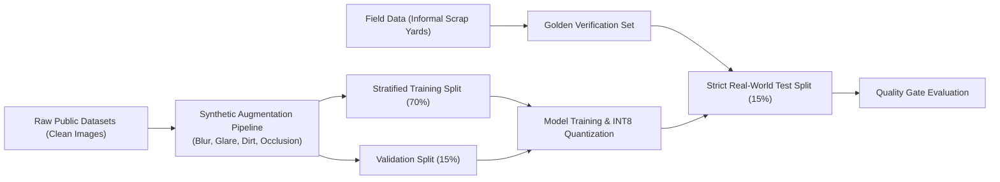

# Machine Learning Training, Validation & Evaluation Methodology
**System:** On-Device Computer Vision Classifier & Detector  
**Model Family:** YOLOv8-Nano / MobileNetV4  
**Primary Metric:** mAP@0.5 and Top-1 Category Accuracy on Real-World Scrap Conditions

---

## 1. The Core Engineering Challenge: Clean Data vs. Real-World Field Conditions

A model trained solely on clean studio images or pristine Kaggle photos fails when deployed in informal scrap yards (*kabadiwala photography*). Real collection environments introduce:
- Heavy motion blur from unsteady hands and low-end camera shutters.
- Extreme lighting variance (pitch-black godowns with a single bulb vs. scorching direct sunlight).
- Partial occlusion (PCBs buried beneath dirty cables, cracked CRT glass).
- Distracting backgrounds (rough gunny sacks, rusted corrugated tin roofs, stained cement).



---

## 2. Dataset Partitioning & Stratification Strategy

To prevent data leakage, images are grouped by **physical source batch** (all images of the same batch/object stay in the same partition):

| Partition | Share | Sample Volume | Composition | Purpose |
| :--- | :--- | :--- | :--- | :--- |
| **Train Set** | **70%** | ~6,000 images | Public datasets + synthetic augmentations + 50% field images | Gradient descent parameter optimization |
| **Validation Set** | **15%** | ~1,300 images | Augmented public + field samples | Hyperparameter tuning & early stopping checkpointing |
| **Golden Test Set** | **15%** | ~1,300 images | **100% unaugmented real-world field images** | Unbiased generalization evaluation |

---

## 3. Real-World Augmentation Pipeline

Implemented in PyTorch / Albumentations:

```python
import albumentations as A

kabadiwala_augmentations = A.Compose([
    # 1. Camera lens blur & shake
    A.OneOf([
        A.MotionBlur(blur_limit=7, p=0.4),
        A.GaussianBlur(blur_limit=5, p=0.3),
        A.Defocus(radius=(2, 5), p=0.3),
    ], p=0.6),

    # 2. Harsh lighting & dark shadows
    A.RandomBrightnessContrast(brightness_limit=0.35, contrast_limit=0.35, p=0.7),
    A.ColorJitter(brightness=0.2, contrast=0.2, saturation=0.2, hue=0.1, p=0.4),

    # 3. Perspective & low-angle phone holding
    A.Perspective(scale=(0.05, 0.12), p=0.5),
    A.HorizontalFlip(p=0.5),
    A.Rotate(limit=25, p=0.5),

    # 4. Occlusion & partial dirt stains
    A.CoarseDropout(max_holes=6, max_height=40, max_width=40, min_holes=2, fill_value=30, p=0.4),
    A.ImageCompression(quality_lower=40, quality_upper=85, p=0.5)
])
```

---

## 4. Evaluation Metrics & Minimum Acceptance Criteria

| Metric | Target Threshold | Rationale |
| :--- | :--- | :--- |
| **Mean Average Precision ($\text{mAP}@0.5$)** | $\ge 82.0\%$ | Global detection precision across all scrap classes |
| **High-Hazard Recall (Batteries & CRTs)** | $\ge 92.0\%$ | Critical safety gate: never misclassify a hazardous battery as benign |
| **Inference Latency (Android Helio G35)** | $\le 75\text{ ms}$ | Smooth on-device viewfinder experience without freezing |
| **Quantized INT8 Model File Size** | $\le 8.0\text{ MB}$ | Small APK download footprint for low-storage devices |
| **Peak Memory Consumption (RAM)** | $\le 80\text{ MB}$ | Prevents Out-Of-Memory (OOM) crashes on 2GB RAM phones |

---

## 5. Post-Training Quantization (PTQ) Workflow

1. Train full-precision model (FP32) in PyTorch / Ultralytics.
2. Export to ONNX representation.
3. Apply INT8 Post-Training Quantization using TensorFlow Lite Converter with a calibration set of 200 real scrap images:
```python
import tensorflow as tf

converter = tf.lite.TFLiteConverter.from_saved_model(saved_model_dir)
converter.optimizations = [tf.lite.Optimize.DEFAULT]
converter.representative_dataset = representative_dataset_gen
converter.target_spec.supported_ops = [tf.lite.OpsSet.TFLITE_BUILTINS_INT8]
converter.inference_input_type = tf.uint8
converter.inference_output_type = tf.uint8
tflite_quant_model = converter.convert()

with open("model_quantized_int8.tflite", "wb") as f:
    f.write(tflite_quant_model)
```
4. Verify accuracy degradation between FP32 and INT8 is $<1.5\%$ mAP drop.
